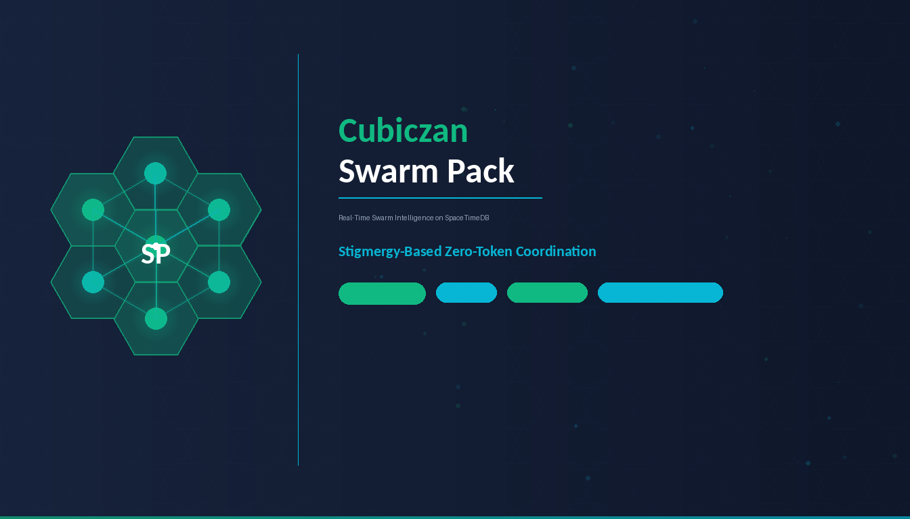

# Cubiczan — Real-Time Swarm Intelligence Platform

<p align="center">
  
  
  
  
  
  
</p>

<p align="center">
  
</p>

Zero-token coordination. Heterogeneous agents. Enterprise-grade swarm intelligence. Built on [SpaceTimeDB](https://spacetimedb.com/) for real-time, serverless, multi-client coordination with zero-polling WebSocket subscriptions.

---

## Demo

https://github.com/user-attachments/assets/demo.mp4

> _3-minute walkthrough: architecture, SpaceTimeDB schema, reducers, scent field, consensus engine, and live dashboard._

Built on [MiroFish](https://github.com/666ghj/MiroFish) (AGPL-3.0) swarm simulation + [TEMM1E](https://github.com/nagisanzenin/temm1e) (MIT) stigmergic coordination + [Kimi K2.5 PARL](https://arxiv.org/abs/2602.02276) parallel agent architecture + [SpaceTimeDB](https://spacetimedb.com/) real-time database.

---

## Why This Exists

Every major multi-agent framework (AutoGen, CrewAI, LangGraph) coordinates agents by making them **talk to each other**. Every coordination message is an LLM call. Every LLM call costs tokens. In complex workflows, the coordination overhead can **exceed the actual work**.

**This is an architecture bug, not a feature.**

Cubiczan replaces inter-agent LLM chat with **stigmergy** — indirect communication via environmental signals (scent pheromones), the same mechanism ant colonies use to solve NP-hard routing problems without centralized control. The entire coordination layer runs as compiled Rust reducers inside SpaceTimeDB, with real-time state streaming to every connected client over WebSocket. No REST API. No polling. No middleware.

### The Math That Matters

| Metric | Traditional (AutoGen/CrewAI) | Cubiczan |
|--------|------------------------------|----------|
| 12-subtask coordination tokens | ~78 LLM calls | **0 coordination calls** |
| Context growth per subtask | **28x** (quadratic) | **~190 bytes flat** (linear) |
| Speed (12 independent tasks) | 103s | **18s (5.86x faster)** |
| Cost (12 independent tasks) | 7,379 tokens | **2,149 tokens (3.4x cheaper)** |
| Simple task overhead | Framework boot cost | **Zero. Invisible.** |

---

## Architecture: 3-Layer Hybrid

```
  REQUEST
     |
     v
+--------------------------------------------------------------+
|  Layer 1: MoE ROUTER (1 nano LLM call)                      |
|  Classifies domain + complexity. Simple tasks -> single agent |
|  Complex tasks (3+ deliverables, speedup >= 1.3x) -> swarm   |
+-----------------------------+--------------------------------+
                              | (complex only)
                              v
+--------------------------------------------------------------+
|  Layer 2: ALPHA DECOMPOSITION (1 LLM call -> DAG)            |
|  Kahn's topological sort, critical path optimization         |
|  Produces dependency graph with tagged subtasks               |
+-----------------------------+--------------------------------+
                              |
        +---------------------+---------------------+
        v                     v                     v
+--------------+   +--------------+   +--------------+
|   Worker 1   |   |   Worker 2   |   |   Worker 3   |  Heterogeneous
|  Qwen-2.5    |   |  DeepSeek-R1 |   |  Llama-3.3   |  models (frozen)
|  +--------+  |   |  +--------+  |   |  +--------+  |
|  |STIGMERGY|  |   |  |STIGMERGY|  |   |  |STIGMERGY|  |  Zero-token
|  | Claim   |  |   |  | Claim   |  |   |  | Claim   |  |  coordination
|  | Emit    |  |   |  | Emit    |  |   |  | Emit    |  |  via SpaceTimeDB
|  | Read    |  |   |  | Read    |  |   |  | Read    |  |  reducers
|  +--------+  |   |  +--------+  |   |  +--------+  |
+------+-------+   +------+-------+   +------+-------+
       |                  |                  |
       +------------------+------------------+
                              |
                              v
                +--------------------------+
                |    SCENT FIELD          |  SpaceTimeDB ScentSignal table
                |    6 signal types       |  Exponential decay via reducer
                |    Task selection:      |  S = A^2.0 * U^1.5 * (1-D)^1.0
                |    Pure arithmetic      |     * (1-F)^0.8 * R^1.2
                |    Zero LLM calls       |
                +--------------------------+
                              |
                              v (if high-stakes)
                +--------------------------+
                |   CONSENSUS ENGINE      |  Adversarial debate + LMSR scoring
                |   Anti-sycophancy       |  Contrarian agent stress-testing
                |   Heterogeneous         |  Min 2 distinct model families
                +--------------------------+
                              |
                              v
                +--------------------------+
                |   PARL REWARD            |  rPARL = L1*r_parallel + L2*r_finish + r_perf
                |   (Kimi K2.5)            |  Prevents serial collapse + over-decomposition
                +--------------------------+
```

### Stigmergy: How Workers Coordinate Without Talking

```
Worker 1 completes Task A -> emits COMPLETION scent (5 min half-life)
Worker 2 reads scent field   -> sees Task B now has all deps met
Worker 2 claims Task B       via claim_task reducer (atomic STDB mutation)
Worker 3 struggles on Task C -> emits DIFFICULTY scent (2 min half-life)
Worker 4 reads field          -> avoids Task C, picks Task D instead (higher score)

Zero LLM calls. Zero coordination tokens. Pure arithmetic. Zero polling.
```

**6 Scent Signal Types:**

| Signal | Half-Life | Purpose |
|--------|-----------|---------|
| `Completion` | 5 min | Task finished |
| `Failure` | 6 min | Attempt failed |
| `Difficulty` | 2 min | Worker struggling |
| `Urgency` | Grows (cap 5.0) | Prevents starvation |
| `Progress` | 20 sec | Worker heartbeat |
| `HelpWanted` | 2 min | Specialist needed |

**Task Selection Formula** (40 lines of arithmetic, not an LLM call):
```
S(worker, task) = Affinity^2.0 * Urgency^1.5 * (1-Difficulty)^1.0
                * (1-Failure)^0.8 * Reward^1.2
```

---

## SpaceTimeDB Integration

The entire coordination backend runs inside [SpaceTimeDB](https://spacetimedb.com/), a hosted real-time relational database that compiles Rust modules and exposes state changes as subscribable WebSocket events. There is no Flask, no REST API, and no polling layer. Clients connect via the `spacetimedb` SDK, subscribe to tables, and invoke reducers directly — SpaceTimeDB handles atomicity, broadcasting, and persistence.

### How It Works

1. **Clients connect** via `spacetimedb.connect(host, db)` — opens a persistent WebSocket
2. **Clients subscribe** with SQL: `SELECT * FROM Task`, `SELECT * FROM ScentSignal`, etc.
3. **Any connected client** invokes a reducer (e.g., `claim_task(task_id, worker_id)`) — executed atomically on the server
4. **All subscribers** receive row-level insert/update/delete events instantly over WebSocket
5. **Pheromone signals** are rows in the `ScentSignal` table — workers emit by inserting, read by aggregating subscribed rows
6. **Zero middleware. Zero polling. Zero coordination tokens.**

### Why SpaceTimeDB

SpaceTimeDB's architecture is uniquely suited for swarm coordination because it merges the database, the backend, and the pub/sub layer into a single runtime:

- **Atomic reducers** replace REST endpoints — task claiming, scent emission, and consensus computation happen in-process with serializable isolation, no application server needed
- **Row-level subscriptions** replace polling — every connected dashboard client receives the exact rows that changed, the instant they change, with zero configuration
- **Multi-client native** — any number of workers, dashboards, or monitoring tools can connect simultaneously and see identical state without any coordination protocol
- **Compiled Rust modules** — reducers run at native speed with no cold-start overhead, no serialization, and no framework bottleneck
- **Hosted and serverless** — no infrastructure to manage, no Docker Compose, no connection pooling — just connect and subscribe

---

## SpaceTimeDB Schema

All coordination state lives in 8 tables inside the SpaceTimeDB module. The dashboard client subscribes to each via SQL queries and receives real-time row events over WebSocket.

### Tables

| Table | Columns | Purpose |
|-------|---------|---------|
| **Worker** | `worker_id`, `display_name`, `model_name`, `tags[]`, `domain`, `is_online`, `connected_at`, `last_heartbeat` | Registered agent instances |
| **Task** | `task_id`, `graph_id`, `status`, `description`, `agent_type`, `tags[]`, `dependencies[]`, `worker_id`, `result`, `retries`, `reward`, `created_at`, `started_at`, `completed_at` | DAG task nodes with lifecycle |
| **ScentSignal** | `signal_id`, `task_id`, `worker_id`, `scent_type`, `intensity`, `emitted_at`, `metadata` | Pheromone signals (6 scent types) |
| **ConsensusVote** | `vote_id`, `round_id`, `task_id`, `agent_id`, `model_name`, `position`, `confidence`, `reasoning`, `is_contrarian`, `voted_at` | Individual consensus votes |
| **ConsensusResult** | `round_id`, `task_id`, `final_position`, `consensus_score`, `debate_rounds`, `escalate_to_human`, `heterogeneity_score`, `total_votes`, `dissenting_count`, `computed_at` | Aggregated consensus outcome |
| **AuditEvent** | `event_id`, `actor`, `action`, `resource`, `payload`, `decision`, `policy_id`, `previous_hash`, `hash`, `timestamp` | Tamper-evident audit chain |
| **SwarmSession** | `session_id`, `graph_id`, `domain`, `task_description`, `total_tasks`, `completed_tasks`, `failed_tasks`, `agents_used`, `status`, `parl_reward`, `theoretical_speedup`, `started_at`, `completed_at` | Session-level tracking |
| **Policy** | `policy_id`, `tool`, `trust_level`, `max_calls`, `window_seconds`, `blocked_actions[]`, `approval_required_actions[]` | Governance policy rules |

### Key Enumerations

**Task Status State Machine:**
```
Pending -> Ready -> Active -> Complete
                 Active -> Failed -> Ready (retry loop)
                 Active -> Failed -> Escalate (max retries exceeded)
```

**Scent Types:** `Completion`, `Failure`, `Difficulty`, `Urgency`, `Progress`, `HelpWanted`

**Session Status:** `Initializing`, `Running`, `Paused`, `Completed`, `Failed`, `PartialSuccess`

**Policy Trust Levels:** `High`, `Medium`, `Low`, `Blocked`

---

## Reducers

SpaceTimeDB reducers are server-side functions that mutate tables atomically inside the database runtime. Any connected client can invoke them — no API layer, no authentication dance, no serialization overhead. Reducers run with serializable isolation guarantees and broadcast their mutations to every subscriber in the same transaction.

| # | Reducer | Description |
|---|---------|-------------|
| 1 | `register_worker` | Register a new agent instance into the swarm with heartbeat tracking |
| 2 | `heartbeat` | Update a worker's last-seen timestamp for liveness detection |
| 3 | `unregister_worker` | Mark a worker as offline and release any claimed tasks |
| 4 | `create_session` | Initialize a new swarm session with domain, task count, and agent pool |
| 5 | `start_session` | Transition session from `Initializing` to `Running` |
| 6 | `add_task` | Insert a new task into the DAG; auto-marks as `Ready` if no dependencies |
| 7 | `claim_task` | Atomically claim a `Ready` task for a worker (`Ready` -> `Active`) |
| 8 | `complete_task` | Mark task complete with result and reward; promote dependent tasks to `Ready`; update session counters |
| 9 | `fail_task` | Fail a task with error payload; increment retry counter; update session failed counter |
| 10 | `emit_scent` | Insert a pheromone signal into the scent field, broadcast to all subscribers |
| 11 | `decay_scents` | Garbage-collect expired scent signals older than a configurable threshold |
| 12 | `grow_urgency` | Find or create an `Urgency` scent for a task and increase intensity, capped at 5.0 |
| 13 | `cast_vote` | Submit an agent's vote in a consensus round with position, confidence, and reasoning |
| 14 | `compute_consensus` | Aggregate votes via LMSR scoring; count total and dissenting votes; produce `ConsensusResult` |
| 15 | `complete_session` | Transition session to `Completed` with final PARL reward score |
| 16 | `log_audit` | Append a tamper-evident event to the audit chain with deterministic hash linking |

---

## Dashboard

The Next.js 16 dashboard provides real-time visibility into the entire swarm. It connects to SpaceTimeDB via WebSocket and updates all panels instantly as reducers mutate tables. When SpaceTimeDB is not available, it runs a full 15-step simulation demo with mock data — no backend required to preview.

### Panels

| Panel | Shows |
|-------|-------|
| **Stats Row** | Worker count, tasks complete (X/Y), scent signal count, consensus score |
| **Workers** | Registered agents with model, domain, tags, online status, last heartbeat |
| **Task DAG** | All tasks with status badges, assigned worker, dependency count, reward |
| **Scent Field Heatmap** | Per-task pheromone intensity bars (6 scent types, color-coded) |
| **Consensus** | Final position, confidence bar, heterogeneity, debate rounds, escalation flag, vote list |
| **Event Stream** | Chronological log of every reducer invocation and state change (auto-scrolling) |
| **Session** | Domain, status, agent count, PARL reward, speedup, progress bar |

---

## Supported Domains (9)

| # | Domain | Feasibility | Key Use Cases |
|---|--------|------------|---------------|
| 1 | **Financial Markets & Trading** | HIGH | Kalshi/Polymarket, commodities, crypto, M&A screening |
| 2 | **Business Intelligence** | HIGH | M&A targets, competitive scanning, multi-source synthesis |
| 3 | **Cybersecurity & Threat Intel** | HIGH | SOC triage (88-97% noise reduction), threat hunting |
| 4 | **Predictive Simulation** | HIGH | Social dynamics forecasting via MiroFish OASIS engine |
| 5 | **Content & Marketing** | MED-HIGH | 3-5x production speed, viral prediction, SEO |
| 6 | **Healthcare & Drug Discovery** | MEDIUM | Drug repurposing, clinical trial design, regulatory nav |
| 7 | **Political & Social Forecasting** | MEDIUM | Election prediction (Brier 0.101 -> closing gap) |
| 8 | **Real Estate & Location Intel** | MEDIUM | Gentrification prediction, site selection, climate risk |
| 9 | **Talent & HR Intelligence** | MEDIUM | Hiring timing, retention signals, comp benchmarking |

---

## Tech Stack

| Layer | Technology | Purpose |
|-------|-----------|---------|
| **Real-Time Database** | **SpaceTimeDB** | Hosted relational DB with WebSocket subscriptions + compiled Rust reducers |
| **Coordination Backend** | **SpaceTimeDB Reducers** | Atomic task claiming, scent emission, consensus, audit — runs inside the DB runtime |
| **Client Transport** | **WebSocket Subscriptions** | Zero-polling real-time state sync to every connected client |
| **Dashboard Client** | **Next.js 16 + TypeScript + Zustand** | Real-time swarm monitoring UI with 7 panels |
| **Simulation Engine** | MiroFish + OASIS (CAMEL-AI) | Multi-agent swarm simulation |
| **Coordination Logic** | Stigmergy (TEMM1E-inspired) | Zero-token pheromone signals |
| **Parallelism** | PARL (Kimi K2.5-inspired) | Dynamic decomposition + reward shaping |
| **Consensus** | LMSR + Contrarian Agents | Anti-sycophancy adversarial debate |
| **Governance Kernel** | PolicyGate + AuditKernel | Approval gates, tamper-evident audit chain |
| **LLM Backend** | Ollama / vLLM / llama.cpp | Self-hosted inference ($0 API cost) |
| **Models** | Qwen-2.5, DeepSeek-R1, Llama-3.3 | Heterogeneous pool (anti-groupthink) |

---

## Quick Start

```bash
# 1. Clone
git clone https://github.com/Cubiczan/Cubiczan-swarm-pack.git
cd Cubiczan-swarm-pack

# 2. Start SpaceTimeDB
spacetimedb start --host 0.0.0.0 --port 3000

# 3. Build and publish the Rust module
cd src/swarm_module
cargo build --release
spacetimedb publish --module-name swarm-module ./target/release/swarm_module.so

# 4. Start the dashboard client
cd ../../client
npm install
npm run dev

# 5. Open http://localhost:3001
```

> **Demo mode:** The dashboard runs a full simulation when SpaceTimeDB is not connected. Click "Run Simulation" to see workers registering, tasks being claimed and completed, scent signals emitting, consensus votes casting, and the audit trail logging — all in real-time. No database or backend required.

---

## Project Structure

```
Cubiczan-swarm-pack/
+-- client/                        # Next.js 16 dashboard
|   +-- src/lib/types.ts           # SpaceTimeDB table type definitions
|   +-- src/lib/spacetime.ts       # WebSocket connection + table subscriptions
|   +-- src/lib/store.ts           # Zustand state management with scent aggregation
|   +-- src/lib/mock-data.ts       # 15-step simulation runner (demo mode)
|   +-- src/app/page.tsx           # Full dashboard UI (7 panels)
|   +-- src/app/globals.css        # Dark theme (slate/navy, emerald primary)
|   +-- src/app/layout.tsx         # Geist fonts, metadata
+-- src/swarm_module/              # SpaceTimeDB Rust module
|   +-- src/lib.rs                 # 8 tables + 16 reducers (533 lines)
|   +-- Cargo.toml                 # Rust dependencies (spacetimedb 1.0)
+-- assets/
|   +-- demo.mp4                   # 3-minute demo video
|   +-- logo.png                   # 512x512 logo
|   +-- thumbnail.png              # 1344x768 DevSpot thumbnail
+-- domains/                       # 9 enterprise domain configurations
+-- agents/                        # Agent definitions and profiles
+-- orchestrator/                   # Coordination engine (Python)
+-- monitoring/                     # Grafana dashboards + Prometheus config
+-- docs/                          # Architecture, domain playbooks, governance
+-- README.md
```

---

## How It Compares

### vs. AutoGen / CrewAI / LangGraph

| Feature | AutoGen | CrewAI | LangGraph | **Cubiczan** |
|---------|---------|--------|-----------|-------------|
| Coordination | LLM-to-LLM chat | LLM delegation | Graph routing | **Stigmergy (0 tokens)** |
| Context growth | Quadratic | Quadratic | Linear (nodes) | **Flat (~190 bytes/worker)** |
| Anti-sycophancy | None | None | None | **LMSR + contrarian + model diversity** |
| Parallel execution | Sequential | Sequential default | Node-level | **Task-level (atomic STDB reducers)** |
| Simple task overhead | Framework boot | Framework boot | Framework boot | **Zero. Invisible.** |
| Real-time updates | Polling | Polling | Polling | **WebSocket push (zero polling)** |
| Domain specialization | Manual | Role-based | Manual | **9 pre-built enterprise domains** |
| Simulation engine | None | None | None | **MiroFish OASIS (33K+ stars)** |

### vs. TEMM1E

| Feature | TEMM1E | **Cubiczan** |
|---------|--------|-------------|
| Language | Rust (17 crates) | **Rust reducers + TypeScript client** |
| Coordination | Stigmergy | **Stigmergy + PARL + Consensus** |
| State store | In-memory | **SpaceTimeDB (persistent, distributed, multi-client)** |
| Real-time sync | None | **WebSocket subscriptions (zero polling)** |
| Domain configs | Generic | **9 enterprise domain packs** |
| Simulation | None | **MiroFish parallel worlds** |
| Anti-sycophancy | N/A (single-model) | **Heterogeneous models + contrarian** |

### vs. Kimi K2.5 Agent Swarm

| Feature | Kimi K2.5 PARL | **Cubiczan** |
|---------|---------------|-------------|
| Coordination tokens | Reduced | **Zero (stigmergy)** |
| Open source models | Kimi K2.5 only | **Any OpenAI-compatible** |
| Task selection | LLM-based | **Arithmetic (40 LOC formula)** |
| Real-time visibility | Logs | **Live WebSocket dashboard** |
| Deployment | Research | **SpaceTimeDB hosted + Docker** |
| Enterprise domains | None | **9 pre-configured domains** |

---

## Cost Estimates

| Configuration | Cloud API (Tiered) | DeepSeek-only | Self-hosted (Ollama) |
|---------------|--------------------|---------------|---------------------|
| 20 agents, hourly | ~$55/mo | ~$15/mo | Compute only |
| 20 agents, 5-min | ~$660/mo | ~$180/mo | Compute only |
| 50 agents, 5-min | ~$5,000/mo | ~$1,166/mo | Compute only |
| **Stigmergy savings** | **~3.4x cheaper** | **~3.4x cheaper** | **~3.4x fewer GPU-hours** |

---

## Key Research References

1. **MiroFish** — Swarm intelligence engine (33K+ GitHub stars). Parallel digital world simulation with OASIS.
2. **TEMM1E v3.0.0** — Stigmergic coordination. 5.86x faster, 3.4x cheaper than LLM-to-LLM chat. MIT licensed.
3. **Kimi K2.5 Agent Swarm** (arXiv:2602.02276) — PARL: trainable orchestrator + frozen subagents. 3-4.5x latency reduction.
4. **CONSENSAGENT** (ACL 2025) — Same-model agents converge sycophantically in 1-2 rounds. Heterogeneous models required.
5. **Google Research** — Centralized hub-and-spoke contains errors to 4.4x vs free-form multi-agent chat.
6. **SpaceTimeDB** — Real-time relational database with compiled module runtime. Rust reducers for atomic state transitions.

---

## License

- MiroFish core: AGPL-3.0
- TEMM1E stigmergy concepts: MIT
- Cubiczan extensions: AGPL-3.0
- Domain configurations: AGPL-3.0

---

## CHP Governance

This repository is hardened with the [Consensus Hardening Protocol (CHP)](https://codeberg.org/cubiczan/consensus-hardening-protocol), Cubiczan's decision-governance layer for multi-agent AI systems.

### Protocol Layers
- **R0 Gate**: All decisions must pass Solvable, Scoped, Valid, Worth_it checks
- **Foundation Disclosure**: 1-3 weakest assumptions, 1-2 invalidation conditions, 1 key vulnerability
- **Adversarial Layer**: Mandatory devil's advocate at Phase 0 and Round 3
- **State Machine**: EXPLORING -> PROVISIONAL -> PROVISIONAL_LOCK -> LOCKED
- **Third-Party Validation**: Independent CONFIRM/REJECT before lock

### Domain Configuration
- **Category**: AI / Agents
- **Foundation Threshold**: 70
- **CFO Accuracy Guard**: Disabled

### Compliance Artifacts
| File | Purpose |
|------|---------|
| `.chp/STATE_MACHINE.md` | Decision state transitions |
| `.chp/R0_CONFIG.yaml` | Domain-calibrated thresholds |
| `.chp/ADVERSARIAL_PROMPTS.md` | Standardized challenge templates |
| `.chp/CHP_COMPLIANCE.md` | Compliance tracking & audit trail |

### CHP Version
cognitive-mesh-orchestrator 0.1.0 | [Protocol Docs](https://codeberg.org/cubiczan/consensus-hardening-protocol)
